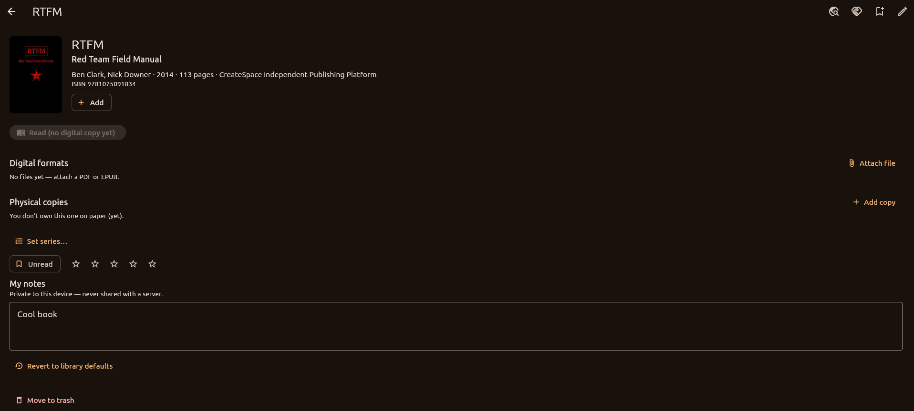
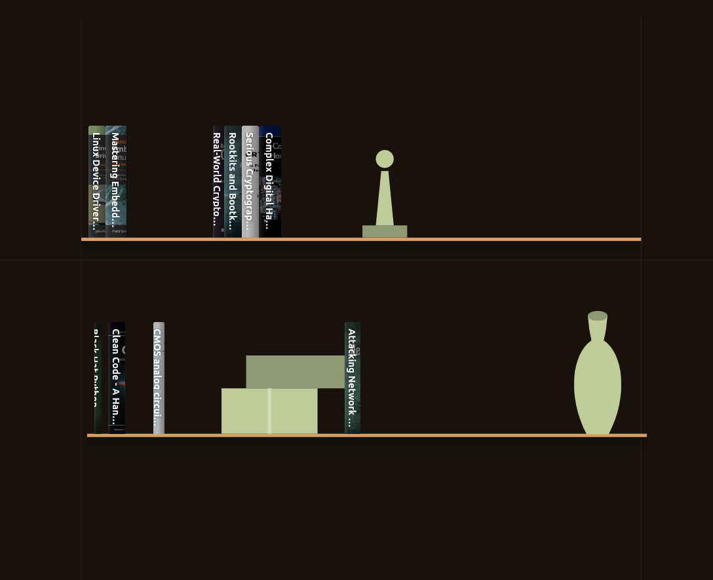

# Vellum

[](https://github.com/AndreiVladescu/Vellum/actions/workflows/ci.yml)
[](LICENSE)


A personal library manager for digital **and** physical books, shown as a visual
bookshelf — you browse your books spine-out, the way they look on a real shelf,
instead of scrolling a grid of covers.

It runs entirely on your own machine. There is no account to create and nothing
is uploaded anywhere, unless you deliberately set up the optional server.


---

## Contents

- [Getting it running](#getting-it-running)
- [Your first ten minutes](#your-first-ten-minutes)
- [Bringing in a library you already have](#bringing-in-a-library-you-already-have)
- [Reading](#reading)
- [Physical books and loans](#physical-books-and-loans)
- [Where your data lives, and backing it up](#where-your-data-lives-and-backing-it-up)
- [Keyboard shortcuts](#keyboard-shortcuts)
- [Optional: sharing a library between devices](#optional-sharing-a-library-between-devices)
- [When something goes wrong](#when-something-goes-wrong)
- [Is it safe to use?](#is-it-safe-to-use)
- [For developers](#for-developers)

---

> **This project was written by an LLM.** The code, the tests and this README
> were generated by Claude working from prompts, with a human directing and
> reviewing the result. It is a real, working program — but it has not been
> through the kind of adversarial testing a project you trust with your only
> copy of something should have. Keep your book files backed up elsewhere, and
> read [Is it safe to use?](#is-it-safe-to-use) before pointing it at a library
> you care about.

---

## Getting it running

**If there is a [release](https://github.com/AndreiVladescu/Vellum/releases)**,
download the build for your system and skip this section.

On **Linux**, take whichever suits you:

| | |
|---|---|
| `Vellum-*.AppImage` | One file. `chmod +x` it and run it — no installation. |
| `vellum_*_amd64.deb` | Debian, Ubuntu, Mint: `sudo apt install ./vellum_*.deb` |
| `vellum-linux-x64.tar.gz` | Anything else: extract, then `./install.sh` |

The `.deb` and `install.sh` both tuck the app out of the way and leave a single
`vellum` command on your PATH plus a menu entry — you never move `lib/` and
`data/` yourself. Undo either with `sudo apt remove vellum` or
`./install.sh --uninstall`; both leave your library alone.

**Windows** and **macOS** builds are unsigned, so macOS wants right-click → Open
on the first launch and Windows SmartScreen wants *More info → Run anyway*.

To build it yourself instead — or if there is no release yet — it takes about
ten minutes, most of which is the toolchain downloading. What follows is the
short version; [DEVELOPER.md](DEVELOPER.md) has the detailed guide for each
platform, including Windows and Android.

### 1. Install Flutter

Follow the official installer for your system:
**<https://docs.flutter.dev/get-started/install>**

Vellum needs Flutter with **Dart SDK 3.12.2 or newer**. Check what you have:

```sh
flutter --version
```

### 2. Install the desktop build tools

Flutter builds a real native app, so it needs your platform's C++ toolchain.

**Linux (Debian/Ubuntu):**

```sh
sudo apt install clang cmake ninja-build pkg-config libgtk-3-dev liblzma-dev \
                 libsecret-1-dev
```

`libsecret-1-dev` is where the server token is stored; leaving it out fails the
build at the CMake step rather than at runtime.

**macOS:** install Xcode from the App Store, then:

```sh
sudo xcodebuild -runFirstLaunch
```

**Windows:** install **Visual Studio 2022** (not VS Code) with the
*"Desktop development with C++"* workload ticked.

Then confirm everything is in place — this is the single most useful command
when anything is wrong:

```sh
flutter doctor
```

You only need the section for your own platform to be green. Android, web and
iOS warnings don't matter unless you want to build for those.

### 3. Get Vellum and run it

```sh
git clone https://github.com/AndreiVladescu/Vellum.git
cd Vellum/app
flutter run -d linux      # or: -d macos   /   -d windows
```

The first run compiles from scratch and takes a few minutes. After that it
starts in seconds.

### 4. Build a copy you can keep

`flutter run` is the development mode. For a proper build you can launch like
any other program:

```sh
flutter build linux --release      # or: macos / windows
```

The result lands in:

| Platform | Path |
|---|---|
| Linux | `app/build/linux/x64/release/bundle/vellum` |
| macOS | `app/build/macos/Build/Products/Release/vellum.app` |
| Windows | `app\build\windows\x64\runner\Release\vellum.exe` |

On Linux, keep the whole `bundle` folder together — the executable needs the
`lib` and `data` folders beside it. Move the folder wherever you like and make a
shortcut to the binary inside it.

### Android

Vellum builds for Android too. That needs JDK 17, the Android SDK and a signing
key — see [DEVELOPER.md](DEVELOPER.md#app-android).

---

## Your first ten minutes

The first time it opens, a short walkthrough offers to get your books in, point
you at a server (optional), and set up a room for your physical shelves. You can
skip it — everything it offers is reachable later from the ☰ menu.

Then you'll be looking at an empty shelf with an **Add book** button.

**Add a book you own the file for.** Press *Add book*, search by title or
author, pick the right result, and attach your PDF or EPUB. Vellum fills in the
cover, author, publisher and description from Open Library and Google Books, so
you usually only type a few words.

**Don't have the file?** Add it anyway. A book with no file is a record of a
physical copy — where it is on your shelves, and who you lent it to.

**Scan a barcode.** The small barcode button above *Add book* looks up an ISBN.
With a camera it scans the back of the book; on a desktop without one, you type
the number.

**Fix anything it got wrong.** Open a book and edit any field. If you make a
mess, *Revert to library defaults* puts back what was originally imported.



A book's own page is where its files, its paper copies, your rating and your
private notes all live — the one above has no file attached yet, which is why
*Read* is greyed out.

**Keep a wishlist.** Books you want but don't own live in ☰ → *Wishlist*, off
the shelf until you attach a file or record a copy — which moves them into the
library by itself. Handy for filling gaps in a series, or scanning something in
a bookshop.

**See what you've been reading.** ☰ → *Reading insights* keeps your sittings,
pages turned and finished books.

**Make it look how you want.** ☰ → *Preferences* controls the shelf: spine
colours and lettering, the wallpaper behind the shelves, whether books show
spine-out or cover-out, and light/dark for the app itself.

---

## Bringing in a library you already have

☰ → *Import a folder* handles four sources:

| You have | Choose | Brings the files |
|---|---|---|
| A folder of PDFs and EPUBs | **A folder of files** | Yes |
| A Calibre library | **A Calibre library** | Yes, with covers |
| A spreadsheet, or a Goodreads export | **A CSV or JSON catalogue** | No — records only |
| Another server's catalogue | **An OPDS catalogue** | Yes, what you pick |

Whichever you choose, Vellum shows you **everything it found and what it thinks
you already have, before writing anything**. Nothing is added until you confirm,
and you can untick individual books.

Naming your files `Author - Title (Year).epub` gets you much better results from
a folder import, but it isn't required.

For the exact CSV columns — and the aliases that let a Goodreads or StoryGraph
export import without editing — see **[docs/IMPORTING.md](docs/IMPORTING.md)**.
The import screen also has a **How?** button that shows the same thing and can
save you a filled-in template spreadsheet.

---

## Reading

Press **Read** on any book with a PDF or EPUB. The button remembers where you
stopped, so it becomes *Resume reading · 43%* next time.

- **Turning pages** — click the left or right edge of the page.
- **Highlighting** — select text, then press the highlighter. Four marker
  colours; the swatch beside the button changes which one you're holding.
- **Notes and bookmarks** — same place as highlights; everything you mark is
  listed on the book's page afterwards.
- **Finding a passage** — `Ctrl+F` searches inside the book, in both formats.
- **Jumping to a page** — `Ctrl+G`, or click the page counter in the toolbar.
- **Night mode** — black pages, white type, pictures in grey. It lives with the
  other reading options: the *Aa* button in an EPUB, the ⋮ menu in a PDF. Those
  also hold page colour, and — for EPUBs — typeface, text size, line spacing and
  line width.
- **Prefer a different reader?** The **open-in-new** button next to *Read* hands
  the file to whatever your system uses for PDFs and EPUBs.

PDFs have two ways to move, toggled from the toolbar: **Pages**, where you see
one page at a time and an edge click turns it, and **Scrolling**, which is
continuous with a scrollbar down the right-hand side.

---

## Physical books and loans

The second tab is for books as objects. Create a **library** (a room), add
**shelves** to it, and record which copy sits where — including a photo of the
shelf as a backdrop, so you can place books on the picture of your actual room.



Books stand, stack or lie flat, and a shelf takes ornaments as well — the point
is that it ends up looking like the shelf you actually own.

When you lend a book, record who has it. Loans are kept as history, so returning
a book doesn't erase the fact it was lent — you keep the record of who has
borrowed what over the years.

---

## Where your data lives, and backing it up

Your library is on your own disk, in two places:

| What | Linux | macOS | Windows |
|---|---|---|---|
| Database | `~/Documents/vellum.sqlite` | `~/Documents/vellum.sqlite` | `Documents\vellum.sqlite` |
| Books, covers, settings | `~/.local/share/com.avladescu.vellum/` | `~/Library/Application Support/com.avladescu.vellum/` | `%APPDATA%\com.avladescu\Vellum\` |

**Back it up from inside the app**: ☰ → *Preferences* → *Backup* writes the
database, covers and book files into a single archive, optionally encrypted with
a passphrase. Restore puts it all back, on this machine or another one. You can
also have it run automatically on a schedule.

Deleting a book puts it in a **trash** that holds it for 30 days, so a mis-click
isn't a restore-from-backup.

---

## Keyboard shortcuts

Press `Ctrl+K` (`⌘K` on macOS) for the command palette — it lists every action
and its shortcut, and jumps to any book by name. The ones worth learning:

| | |
|---|---|
| `Ctrl+K` | Command palette |
| `Ctrl+F` | Search your library — and, in a book, search inside it |
| `Ctrl+N` | Add a book |
| `Ctrl+I` | Import a folder |
| `Ctrl+B` | Switch between spines and covers |
| `Ctrl+G` | *(in a book)* Go to page |
| `F5` | Sync with the server |
| `Ctrl+,` | Preferences |
| `Esc` | Clear the search and filters — or close the find bar |
| `Alt+←` / `Alt+→` | Back and forward, as do the mouse's side buttons |

---

## Optional: sharing a library between devices

**You do not need this.** The app is complete on its own, works offline, and
never contacts a server unless you tell it to. Set one up only if you want:

- the same library on a desktop and a phone, kept in sync,
- other people with their own accounts and permissions,
- an OPDS feed so an e-reader can pull books directly,
- public links to share one book with someone.

Quick try on your own machine:

```sh
cd server
cargo run          # needs Rust: https://rustup.rs
```

That starts the API on <http://localhost:3000> and creates its database beside
itself. Open that address in a browser for the admin console — on a server with
no accounts it opens on *Create the master account*, and the account you make
there owns the library. In the app, ☰ → *Library server*, enter the address, and
log in.

Everything else is configured by environment variables, and
**[`server/.env.example`](server/.env.example)** lists all of them with their
defaults — the port and database path, TLS for a LAN server, SMTP so password
resets can be emailed, and the bootstrap token that stops a stranger claiming
the master account on a server you've exposed. Copy it and edit:

```sh
cd server
cp .env.example .env         # .env is gitignored; chmod 600 it, it holds a password
set -a; . ./.env; set +a
cargo run
```

Over a network — especially to a phone — you need HTTPS, and there are real
decisions to make about certificates, backups and running it as a service.
That is all in **[docs/DEPLOYMENT.md](docs/DEPLOYMENT.md)**, including Docker
and Docker Compose with automatic TLS.

---

## When something goes wrong

**`flutter: command not found`** — Flutter isn't on your `PATH`. Reopen your
terminal after installing, or add its `bin` folder yourself.

**`flutter doctor` complains about Android or Chrome** — ignore it. You only
need your own desktop platform to be green.

**The build fails on Linux mentioning GTK, ninja or clang** — the build tools
from step 2 are missing. Run the `apt install` line and try again.

**The build fails after you pulled a newer version** — clear the build cache:

```sh
cd app
flutter clean
flutter pub get
flutter run -d linux
```

**A PDF won't open, or a book shows no cover** — the file it points at has
probably moved or been deleted. ☰ → *Preferences* → *Library health* finds
exactly this: books whose file is gone, covers that vanished, and files on disk
no book refers to any more. It tells you what it found and lets you decide
whether to repair each kind.

**The app opens to an empty shelf after moving machines** — it looks for the
database in your Documents folder. Copy `vellum.sqlite` *and* the data folder
from the table above, or better, restore a backup archive.

**A search finds nothing you expect** — the shelf search matches titles and
authors. Searching *inside* books is a server feature, and it has to be switched
on there.

---

## Is it safe to use?

Being honest about what this is:

- **The code was written by an LLM.** It is tested — over 840 automated tests
  run against it, and the readers and importers have been driven by hand — but
  that is not the same as years of use by many people.
- **It never deletes your original files.** Importing copies files into its own
  folder; the originals stay where they were. Removing a book moves it to a
  trash that holds it for 30 days.
- **It works offline and keeps everything local.** Metadata lookups go to Open
  Library and Google Books when you add a book, and nothing else leaves your
  machine unless you set up the server.
- **Back up anyway.** Use the built-in backup, and keep your book files
  somewhere Vellum isn't the only copy.

---

## For developers

**Start with [DEVELOPER.md](DEVELOPER.md)** — the full build guide: what to
install on Linux, Windows and macOS, how to build the app and the server on each,
Android and Docker, the test loop, schema changes, and how a release is cut.

| Directory | What | Stack |
|---|---|---|
| [`app/`](app/) | Desktop (Linux/Windows/macOS) + Android app | Flutter, SQLite (drift) |
| [`server/`](server/) | Optional self-hosted library server | Rust, axum, SQLite (sqlx) |

```sh
cd app
flutter test          # ~845 tests
flutter analyze       # lint and static analysis
dart run build_runner build --delete-conflicting-outputs   # after schema changes

cd ../server
cargo test
cargo clippy
```

The architecture, data model and build order are in
[DESIGN.md](DESIGN.md). Other documents:

| | |
|---|---|
| [DEVELOPER.md](DEVELOPER.md) | Building, testing and releasing, on every platform |
| [docs/IMPORTING.md](docs/IMPORTING.md) | Catalogue file formats and filename rules |
| [docs/DEPLOYMENT.md](docs/DEPLOYMENT.md) | Running the server properly |
| [docs/FDROID.md](docs/FDROID.md) | Publishing to F-Droid, and what blocks it |
| [docs/ACCESSIBILITY.md](docs/ACCESSIBILITY.md) | Screen readers, contrast, text scaling |
| [docs/PERFORMANCE.md](docs/PERFORMANCE.md) | Where the time goes, and the budgets |
| [docs/SECURITY_AUDIT.md](docs/SECURITY_AUDIT.md) | What has been reviewed, and what hasn't |

Building for Windows, Android, or anything beyond the quick commands above is in
**[DEVELOPER.md](DEVELOPER.md)**.

---

## Status

The standalone app is functional: add books with online metadata, a spine/cover
shelf, PDF and EPUB readers with highlights and notes, bulk import, backups, and
physical-copy loan tracking. The optional server adds multi-user accounts, roles,
book groups, sharing and public per-book links; the app logs in and syncs **both
ways**, with last-write-wins by timestamp and delete tombstones so edits and
deletions propagate instead of resurrecting.

See the build order and the sync roadmap in
[DESIGN.md](DESIGN.md#build-order--status).

---

## Licence

Vellum is free software under the **GNU Affero General Public License v3.0** —
see [LICENSE](LICENSE).

In plain terms: use it for anything, change it, share it. The one condition is
that anything you pass on stays under the same licence, source included. The
"Affero" part extends that to running it as a service: if you host a modified
Vellum server for other people, those people are entitled to your changes, even
though you never handed them a copy of the program.

That is the trade this project is making deliberately — take it and build on it,
but improvements come back rather than disappearing into a closed fork.
