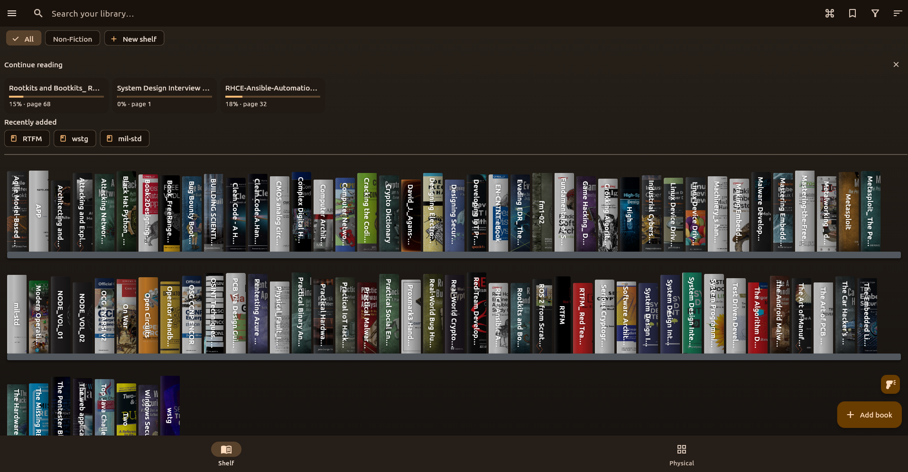

# Vellum app

The Flutter client — a visual bookshelf for digital and physical books that
works fully offline and can optionally sync with a self-hosted Vellum server.
See the repo root [`DESIGN.md`](../DESIGN.md) for architecture and data model.



## Run

```sh
flutter run          # desktop (Linux/Windows/macOS) or a connected device
flutter analyze      # static analysis
flutter test         # tests
dart run build_runner build --delete-conflicting-outputs   # regenerate drift code
```

## Platform notes

- **Secure token storage.** The sync-server session token is kept in the
  platform secure store via `flutter_secure_storage`. On **Linux** this needs
  `libsecret` at runtime and `libsecret-1-dev` to build
  (`sudo apt install libsecret-1-dev`) plus a running keyring (e.g.
  GNOME Keyring). If no keyring is present the app falls back to preferences.
- **Server URLs default to `https://`.** Type an explicit `http://` for an
  unencrypted connection; the connect screen warns when a URL is cleartext.
